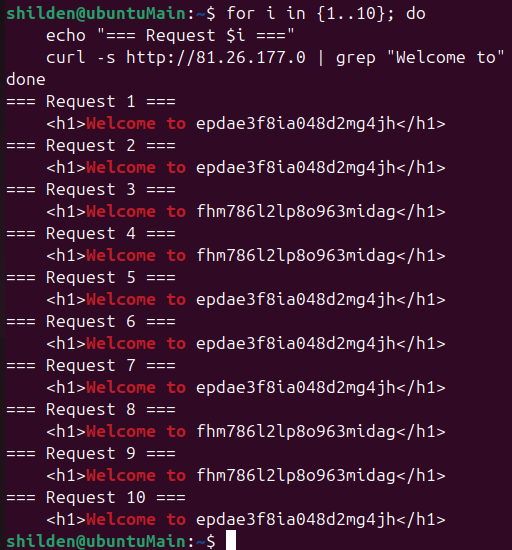
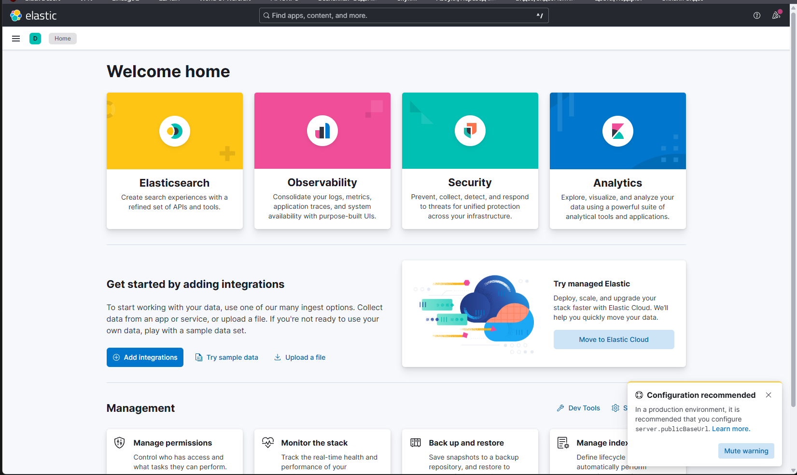
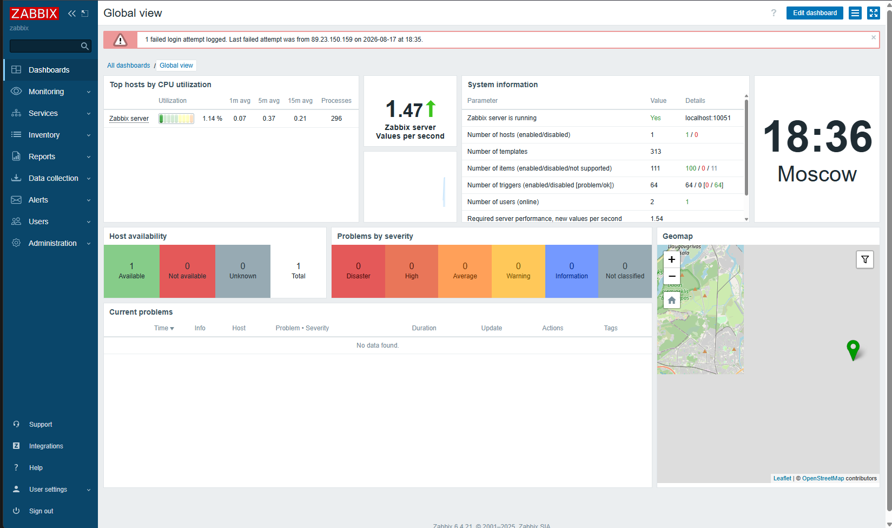
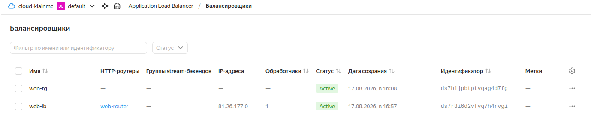

# Дипломная работа по профессии «Системный администратор»

---

### Задача

Ключевая задача — разработать отказоустойчивую инфраструктуру для сайта, включающую мониторинг, сбор логов и резервное копирование основных данных. Инфраструктура должна размещаться в Yandex Cloud и отвечать минимальным стандартам безопасности: запрещается выкладывать токен от облака в git. Используйте инструкцию.

Перед началом работы над дипломным заданием изучите Инструкция по экономии облачных ресурсов.

### Инфраструктура

Для развёртки инфраструктуры используйте Terraform и Ansible.

Не используйте для ansible inventory ip-адреса! Вместо этого используйте fqdn имена виртуальных машин в зоне ".ru-central1.internal". Пример: example.ru-central1.internal - для этого достаточно при создании ВМ указать name=example, hostname=examle !!

Важно: используйте по-возможности минимальные конфигурации ВМ:2 ядра 20% Intel ice lake, 2-4Гб памяти, 10hdd, прерываемая.

Так как прерываемая ВМ проработает не больше 24ч, перед сдачей работы на проверку дипломному руководителю сделайте ваши ВМ постоянно работающими.

Ознакомьтесь со всеми пунктами из этой секции, не беритесь сразу выполнять задание, не дочитав до конца. Пункты взаимосвязаны и могут влиять друг на друга.

### Сайт

Создайте две ВМ в разных зонах, установите на них сервер nginx, если его там нет. ОС и содержимое ВМ должно быть идентичным, это будут наши веб-сервера.

Используйте набор статичных файлов для сайта. Можно переиспользовать сайт из домашнего задания.

Виртуальные машины не должны обладать внешним Ip-адресом, те находится во внутренней сети. Доступ к ВМ по ssh через бастион-сервер. Доступ к web-порту ВМ через балансировщик yandex cloud.

Настройка балансировщика:

Создайте Target Group, включите в неё две созданных ВМ.

Создайте Backend Group, настройте backends на target group, ранее созданную. Настройте healthcheck на корень (/) и порт 80, протокол HTTP.

Создайте HTTP router. Путь укажите — /, backend group — созданную ранее.

Создайте Application load balancer для распределения трафика на веб-сервера, созданные ранее. Укажите HTTP router, созданный ранее, задайте listener тип auto, порт 80.

Протестируйте сайт curl -v <публичный IP балансера>:80

### Мониторинг

Создайте ВМ, разверните на ней Zabbix. На каждую ВМ установите Zabbix Agent, настройте агенты на отправление метрик в Zabbix.

Настройте дешборды с отображением метрик, минимальный набор — по принципу USE (Utilization, Saturation, Errors) для CPU, RAM, диски, сеть, http запросов к веб-серверам. Добавьте необходимые tresholds на соответствующие графики.

### Логи

Cоздайте ВМ, разверните на ней Elasticsearch. Установите filebeat в ВМ к веб-серверам, настройте на отправку access.log, error.log nginx в Elasticsearch.

Создайте ВМ, разверните на ней Kibana, сконфигурируйте соединение с Elasticsearch.

### Сеть

Разверните один VPC. Сервера web, Elasticsearch поместите в приватные подсети. Сервера Zabbix, Kibana, application load balancer определите в публичную подсеть.

Настройте Security Groups соответствующих сервисов на входящий трафик только к нужным портам.

Настройте ВМ с публичным адресом, в которой будет открыт только один порт — ssh. Эта вм будет реализовывать концепцию bastion host . Синоним "bastion host" - "Jump host". Подключение ansible к серверам web и Elasticsearch через данный bastion host можно сделать с помощью ProxyCommand . Допускается установка и запуск ansible непосредственно на bastion host.(Этот вариант легче в настройке)

Исходящий доступ в интернет для ВМ внутреннего контура через NAT-шлюз.

### Резервное копирование

Создайте snapshot дисков всех ВМ. Ограничьте время жизни snaphot в неделю. Сами snaphot настройте на ежедневное копирование.

### Дополнительно

Не входит в минимальные требования.

1. Для Zabbix можно реализовать разделение компонент - frontend, server, database. Frontend отдельной ВМ поместите в публичную подсеть, назначте публичный IP. Server поместите в приватную подсеть, настройте security group на разрешение трафика между frontend и server. Для Database используйте Yandex Managed Service for PostgreSQL. Разверните кластер из двух нод с автоматическим failover.
2. Вместо конкретных ВМ, которые входят в target group, можно создать Instance Group, для которой настройте следующие правила автоматического горизонтального масштабирования: минимальное количество ВМ на зону — 1, максимальный размер группы — 3.
3. В Elasticsearch добавьте мониторинг логов самого себя, Kibana, Zabbix, через filebeat. Можно использовать logstash тоже.
4. Воспользуйтесь Yandex Certificate Manager, выпустите сертификат для сайта, если есть доменное имя. Перенастройте работу балансера на HTTPS, при этом нацелен он будет на HTTP веб-серверов.

---

<h2 align="center">Решение</h2>

---

# Описание проекта

В рамках дипломной работы разработана и развернута отказоустойчивая инфраструктура для веб-сайта в облачной платформе Yandex Cloud. Проект демонстрирует навыки построения современных высокодоступных систем с использованием Infrastructure as Code (IaC), автоматизации конфигурации, мониторинга, централизованного логирования и резервного копирования.

# Архитектура


# Используемые инструменты

| Инструмент | Назначение |  
|------------|------------|
| Terraform | Infrastructure as Code (IaC) — создание и управление облачной инфраструктурой |
| Ansible | Автоматизация настройки серверов (установка Nginx, конфигурация) |
| Yandex Cloud CLI | Управление облачными ресурсами |
| Nginx | Веб-сервер для демонстрации статического контента |
| Application Load Balancer | Балансировка нагрузки между web-серверами |
| Bastion Host (Jump Host) | Безопасный доступ к приватным серверам по SSH |
| NAT Instance | Доступ в интернет из приватных подсетей |
| Zabbix | Система мониторинга |
| Elasticsearch + Kibana + Filebeat | Централизованный сбор и визуализация логов |

# Сетевая структура

| Тип | Подсеть | CIDR | Зона |
|-----|-----|-----|-----|
| Публичная | public-a | 10.0.1.0/24 | ru-central1-a |
| Публичная | public-b | 10.0.2.0/24 | ru-central1-b |
| Приватная | private-a | 10.0.11.0/24 | ru-central1-a |
| Приватная | private-b | 10.0.12.0/24 | ru-central1-b |

# Расположение сервисов по подсетям

| Сервис | Подсеть | IP-адрес |
|--------|---------|----------|
| Бастион | public-b | 158.160.86.99 |
| NAT Instance | public-a | 158.160.51.141 |
| Web-1 | private-a | 10.0.11.11 |
| Web-2 | private-b | 10.0.12.8 |
| Zabbix | public-b | 158.160.18.181 |
| Kibana | public-b | 89.169.181.227 |
| Elasticsearch | private-b | 10.0.12.29 |
| Балансировщик | public-b | 81.26.177.0 |

# Параметры виртуальных машин

Все ВМ используют минимальные конфигурации для экономии бюджета:

|Параметр|Значение|
|--------|--------|
|Платформа |	Intel Ice Lake (standard-v3) |
|vCPU | 2 ядра |
|Гарантированная доля vCPU | 20% |
|RAM |	2-4 ГБ |
|Диск |	10 ГБ HDD |
|Тип ВМ |	Прерываемая (preemptible) — для разработки |
|ОС|	Ubuntu 22.04 LTS |

Важно: Перед сдачей диплома ВМ были переведены в непрерываемый режим.

# Результат работы:

## Доступ для проверки

| Ресурс | URL | Статус |
|--------|-----|--------|
| Сайт | http://81.26.177.0 | ✅ Работает |
| Kibana | http://89.169.181.227:5601 | ✅ Работает |
| Zabbix | http://158.160.18.181/zabbix | ✅ Работает |
| Бастион | ssh ubuntu@158.160.86.99 | ✅ Доступен |

### Внутренние ресурсы (через SSH-туннель)

|Ресурс|Команда|URL|
|-|-|-|
|Elasticsearch|ssh -L 9200:10.0.12.29:9200 ubuntu@158.160.86.99|http://localhost:9200|
|Web-1|ssh ubuntu@10.0.11.11 (с бастиона)||
|Web-2|ssh ubuntu@10.0.12.8 (с бастиона)||

# Скриншоты

Сайт


Проверка балансировки



Кибана



Заббикс



Балансировщики




---

<h2 align="center">Вывод</h2>

---

В ходе работы были решены следующие задачи:

- Разработана архитектура отказоустойчивого веб-приложения в облаке

- Реализована сеть с публичными и приватными подсетями, NAT и Security Groups

- Настроен безопасный доступ к серверам через Bastion Host

- Автоматизирована установка Nginx с помощью Ansible

- Настроен Application Load Balancer с Health Check

- Реализована система мониторинга (Zabbix)

- Настроен сбор логов (Elasticsearch + Filebeat + Kibana)

- Применен подход Infrastructure as Code через Terraform

# Экономия бюджета

В периоды простоя инфраструктура останавливается:

```bash
# Остановка всех ВМ
yc compute instance stop web-1 web-2 bastion nat-instance zabbix kibana elasticsearch

# Удаление балансировщика
yc application-load-balancer load-balancer delete web-lb
```

Расходы в простое: ~50 ₽/мес (только диски)

# Быстрое восстановление

```
# Запуск ВМ
yc compute instance start nat-instance bastion web-1 web-2 zabbix kibana elasticsearch

# Восстановление балансировщика
yc application-load-balancer load-balancer create \
  --name web-lb \
  --network-id $(yc vpc network get diploma-vpc --format yaml | grep "    id:" | awk '{print $2}') \
  --listener name=http-listener,port=80,http-router-id=$(yc application-load-balancer http-router get web-router --format yaml | grep "    id:" | awk '{print $2}') \
  --subnet-id $(yc vpc subnet get public-b --format yaml | grep "    id:" | awk '{print $2}')
```

# Использованные источники

[Документация Yandex Cloud](https://cloud.yandex.ru/docs)

[Документация Terraform](https://www.terraform.io/docs)

[Документация Ansible](https://docs.ansible.com/)

[Документация Nginx](https://nginx.org/en/docs/)

[Документация Zabbix](https://www.zabbix.com/documentation)

[Документация Elastic Stack](https://www.elastic.co/guide)

---
