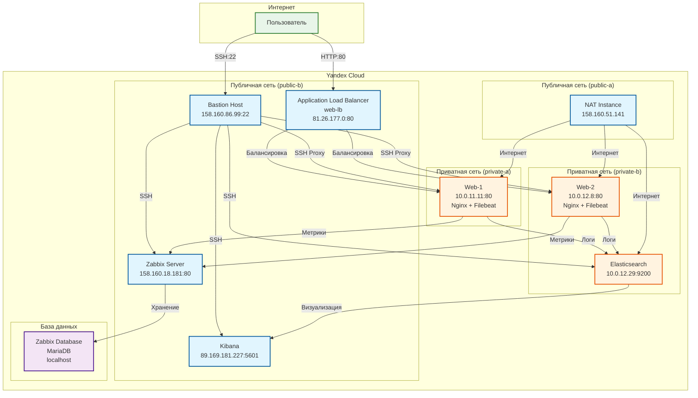

# Дипломная работа по профессии «Системный администратор»

---

### Задача

Ключевая задача — разработать отказоустойчивую инфраструктуру для сайта, включающую мониторинг, сбор логов и резервное копирование основных данных. Инфраструктура должна размещаться в Yandex Cloud и отвечать минимальным стандартам безопасности: запрещается выкладывать токен от облака в git. Используйте инструкцию.

Перед началом работы над дипломным заданием изучите Инструкция по экономии облачных ресурсов.

### Инфраструктура

Для развёртки инфраструктуры используйте Terraform и Ansible.

Не используйте для ansible inventory ip-адреса! Вместо этого используйте fqdn имена виртуальных машин в зоне ".ru-central1.internal". Пример: example.ru-central1.internal - для этого достаточно при создании ВМ указать name=example, hostname=examle !!

Важно: используйте по-возможности минимальные конфигурации ВМ:2 ядра 20% Intel ice lake, 2-4Гб памяти, 10hdd, прерываемая.

Так как прерываемая ВМ проработает не больше 24ч, перед сдачей работы на проверку дипломному руководителю сделайте ваши ВМ постоянно работающими.

Ознакомьтесь со всеми пунктами из этой секции, не беритесь сразу выполнять задание, не дочитав до конца. Пункты взаимосвязаны и могут влиять друг на друга.

### Сайт

Создайте две ВМ в разных зонах, установите на них сервер nginx, если его там нет. ОС и содержимое ВМ должно быть идентичным, это будут наши веб-сервера.

Используйте набор статичных файлов для сайта. Можно переиспользовать сайт из домашнего задания.

Виртуальные машины не должны обладать внешним Ip-адресом, те находится во внутренней сети. Доступ к ВМ по ssh через бастион-сервер. Доступ к web-порту ВМ через балансировщик yandex cloud.

Настройка балансировщика:

Создайте Target Group, включите в неё две созданных ВМ.

Создайте Backend Group, настройте backends на target group, ранее созданную. Настройте healthcheck на корень (/) и порт 80, протокол HTTP.

Создайте HTTP router. Путь укажите — /, backend group — созданную ранее.

Создайте Application load balancer для распределения трафика на веб-сервера, созданные ранее. Укажите HTTP router, созданный ранее, задайте listener тип auto, порт 80.

Протестируйте сайт curl -v <публичный IP балансера>:80

### Мониторинг

Создайте ВМ, разверните на ней Zabbix. На каждую ВМ установите Zabbix Agent, настройте агенты на отправление метрик в Zabbix.

Настройте дешборды с отображением метрик, минимальный набор — по принципу USE (Utilization, Saturation, Errors) для CPU, RAM, диски, сеть, http запросов к веб-серверам. Добавьте необходимые tresholds на соответствующие графики.

### Логи

Cоздайте ВМ, разверните на ней Elasticsearch. Установите filebeat в ВМ к веб-серверам, настройте на отправку access.log, error.log nginx в Elasticsearch.

Создайте ВМ, разверните на ней Kibana, сконфигурируйте соединение с Elasticsearch.

### Сеть

Разверните один VPC. Сервера web, Elasticsearch поместите в приватные подсети. Сервера Zabbix, Kibana, application load balancer определите в публичную подсеть.

Настройте Security Groups соответствующих сервисов на входящий трафик только к нужным портам.

Настройте ВМ с публичным адресом, в которой будет открыт только один порт — ssh. Эта вм будет реализовывать концепцию bastion host . Синоним "bastion host" - "Jump host". Подключение ansible к серверам web и Elasticsearch через данный bastion host можно сделать с помощью ProxyCommand . Допускается установка и запуск ansible непосредственно на bastion host.(Этот вариант легче в настройке)

Исходящий доступ в интернет для ВМ внутреннего контура через NAT-шлюз.

### Резервное копирование

Создайте snapshot дисков всех ВМ. Ограничьте время жизни snaphot в неделю. Сами snaphot настройте на ежедневное копирование.

### Дополнительно

Не входит в минимальные требования.

1. Для Zabbix можно реализовать разделение компонент - frontend, server, database. Frontend отдельной ВМ поместите в публичную подсеть, назначте публичный IP. Server поместите в приватную подсеть, настройте security group на разрешение трафика между frontend и server. Для Database используйте Yandex Managed Service for PostgreSQL. Разверните кластер из двух нод с автоматическим failover.
2. Вместо конкретных ВМ, которые входят в target group, можно создать Instance Group, для которой настройте следующие правила автоматического горизонтального масштабирования: минимальное количество ВМ на зону — 1, максимальный размер группы — 3.
3. В Elasticsearch добавьте мониторинг логов самого себя, Kibana, Zabbix, через filebeat. Можно использовать logstash тоже.
4. Воспользуйтесь Yandex Certificate Manager, выпустите сертификат для сайта, если есть доменное имя. Перенастройте работу балансера на HTTPS, при этом нацелен он будет на HTTP веб-серверов.

---

<h2 align="center">Решение</h2>

---

# Описание проекта

В рамках дипломной работы разработана и развернута отказоустойчивая инфраструктура для веб-сайта в облачной платформе Yandex Cloud. Проект демонстрирует навыки построения современных высокодоступных систем с использованием Infrastructure as Code (IaC), автоматизации конфигурации, мониторинга, централизованного логирования и резервного копирования.

# Архитектура



# Используемые инструменты

| Инструмент | Назначение |  
|------------|------------|
| Terraform | Infrastructure as Code (IaC) — создание и управление облачной инфраструктурой |
| Ansible | Автоматизация настройки серверов (установка Nginx, конфигурация) |
| Yandex Cloud CLI | Управление облачными ресурсами |
| Nginx | Веб-сервер для демонстрации статического контента |
| Application Load Balancer | Балансировка нагрузки между web-серверами |
| Bastion Host (Jump Host) | Безопасный доступ к приватным серверам по SSH |
| NAT Instance | Доступ в интернет из приватных подсетей |
| Zabbix | Система мониторинга |
| Elasticsearch + Kibana + Filebeat | Централизованный сбор и визуализация логов |

# Сетевая структура

| Тип | Подсеть | CIDR | Зона |
|-----|-----|-----|-----|
| Публичная | public-a | 10.0.1.0/24 | ru-central1-a |
| Публичная | public-b | 10.0.2.0/24 | ru-central1-b |
| Приватная | private-a | 10.0.11.0/24 | ru-central1-a |
| Приватная | private-b | 10.0.12.0/24 | ru-central1-b |

# Расположение сервисов по подсетям

| Сервис | Подсеть | IP-адрес |
|--------|---------|----------|
| Бастион | public-b | 158.160.86.99 |
| NAT Instance | public-a | 158.160.51.141 |
| Web-1 | private-a | 10.0.11.11 |
| Web-2 | private-b | 10.0.12.8 |
| Zabbix | public-b | 158.160.18.181 |
| Kibana | public-b | 89.169.181.227 |
| Elasticsearch | private-b | 10.0.12.29 |
| Балансировщик | public-b | 81.26.177.0 |

# Параметры виртуальных машин

Все ВМ используют минимальные конфигурации для экономии бюджета:

|Параметр|Значение|
|--------|--------|
|Платформа |	Intel Ice Lake (standard-v3) |
|vCPU | 2 ядра |
|Гарантированная доля vCPU | 20% |
|RAM |	2-4 ГБ |
|Диск |	10 ГБ HDD |
|Тип ВМ |	Прерываемая (preemptible) — для разработки |
|ОС|	Ubuntu 22.04 LTS |

Важно: Перед сдачей диплома ВМ были переведены в непрерываемый режим.

# Результат работы:

## Доступ для проверки

| Ресурс | URL | Статус |
|--------|-----|--------|
| Сайт | http://81.26.177.0 | ✅ Работает |
| Kibana | http://89.169.181.227:5601 | ✅ Работает |
| Zabbix | http://158.160.18.181/zabbix | ✅ Работает |
| Бастион | ssh ubuntu@158.160.86.99 | ✅ Доступен |

### Внутренние ресурсы (через SSH-туннель)

|Ресурс|Команда|URL|
|-|-|-|
|Elasticsearch|ssh -L 9200:10.0.12.29:9200 ubuntu@158.160.86.99|http://localhost:9200|
|Web-1|ssh ubuntu@10.0.11.11 (с бастиона)||
|Web-2|ssh ubuntu@10.0.12.8 (с бастиона)||

# Скриншоты

Сайт


Проверка балансировки


Кибана


Заббикс


Балансировщики


---

<h2 align="center">Вывод</h2>

---

В ходе работы были решены следующие задачи:

- Разработана архитектура отказоустойчивого веб-приложения в облаке

- Реализована сеть с публичными и приватными подсетями, NAT и Security Groups

- Настроен безопасный доступ к серверам через Bastion Host

- Автоматизирована установка Nginx с помощью Ansible

- Настроен Application Load Balancer с Health Check

- Реализована система мониторинга (Zabbix)

- Настроен сбор логов (Elasticsearch + Filebeat + Kibana)

- Применен подход Infrastructure as Code через Terraform

# Экономия бюджета

В периоды простоя инфраструктура останавливается:

```bash
# Остановка всех ВМ
yc compute instance stop web-1 web-2 bastion nat-instance zabbix kibana elasticsearch

# Удаление балансировщика
yc application-load-balancer load-balancer delete web-lb
```

Расходы в простое: ~50 ₽/мес (только диски)

# Быстрое восстановление

```
# Запуск ВМ
yc compute instance start nat-instance bastion web-1 web-2 zabbix kibana elasticsearch

# Восстановление балансировщика
yc application-load-balancer load-balancer create \
  --name web-lb \
  --network-id $(yc vpc network get diploma-vpc --format yaml | grep "    id:" | awk '{print $2}') \
  --listener name=http-listener,port=80,http-router-id=$(yc application-load-balancer http-router get web-router --format yaml | grep "    id:" | awk '{print $2}') \
  --subnet-id $(yc vpc subnet get public-b --format yaml | grep "    id:" | awk '{print $2}')
```

---

### Конфигурационные файлы:

[terraform](https://github.com/Kaistaore/diplomaproject/tree/main/configs/terraform)

<details>
<summary>main.tf</summary>

```
# ============================================
# 1. VPC NETWORK
# ============================================

resource "yandex_vpc_network" "diploma" {
  name        = var.vpc_name
  description = "VPC network for diploma project"
}

# ============================================
# 2. PUBLIC SUBNETS
# ============================================

resource "yandex_vpc_subnet" "public" {
  for_each = var.public_subnet_cidrs
  
  name           = "public-${each.key}"
  description    = "Public subnet in ${each.key}"
  zone           = each.key
  network_id     = yandex_vpc_network.diploma.id
  v4_cidr_blocks = [each.value]
}

# ============================================
# 3. PRIVATE SUBNETS (with NAT)
# ============================================

resource "yandex_vpc_subnet" "private" {
  for_each = var.private_subnet_cidrs
  
  name           = "private-${each.key}"
  description    = "Private subnet in ${each.key}"
  zone           = each.key
  network_id     = yandex_vpc_network.diploma.id
  v4_cidr_blocks = [each.value]
  
  route_table_id = yandex_vpc_route_table.private_nat.id
}

# ============================================
# 4. NAT INSTANCE (для доступа в интернет из приватных подсетей)
# ============================================

resource "yandex_compute_disk" "nat_disk" {
  name  = "nat-disk"
  type  = "network-hdd"
  zone  = var.default_zone
  size  = var.vm_disk_size
  image_id = var.vm_image_id
}

resource "yandex_compute_instance" "nat" {
  name        = "nat-instance"
  platform_id = var.vm_platform
  zone        = var.default_zone
  
  resources {
    cores         = 2
    memory        = 2
    core_fraction = 20
  }
  
  boot_disk {
    disk_id = yandex_compute_disk.nat_disk.id
  }
  
  network_interface {
    subnet_id = yandex_vpc_subnet.public[var.default_zone].id
    nat       = true
  }
  
  metadata = {
    user-data = "#cloud-config\nhostname: nat\nfqdn: nat.ru-central1.internal"
    ssh-keys  = "ubuntu:${file(var.ssh_public_key)}"
  }
  
  allow_stopping_for_update = true
}

# ============================================
# 5. ROUTE TABLE (для приватных подсетей)
# ============================================

resource "yandex_vpc_route_table" "private_nat" {
  name       = "private-nat-route"
  network_id = yandex_vpc_network.diploma.id
  
  static_route {
    destination_prefix = "0.0.0.0/0"
    next_hop_address   = yandex_compute_instance.nat.network_interface.0.ip_address
  }
}

# ============================================
# 6. SECURITY GROUPS
# ============================================

# --- Bastion SG ---
resource "yandex_vpc_security_group" "bastion" {
  name        = "bastion-sg"
  description = "Security group for bastion host"
  network_id  = yandex_vpc_network.diploma.id
  
  ingress {
    protocol       = "TCP"
    description    = "SSH from anywhere"
    v4_cidr_blocks = ["0.0.0.0/0"]
    port           = 22
  }
  
  egress {
    protocol       = "ANY"
    description    = "Allow all outgoing"
    v4_cidr_blocks = ["0.0.0.0/0"]
  }
}

# --- Web Servers SG ---
resource "yandex_vpc_security_group" "web" {
  name        = "web-sg"
  description = "Security group for web servers"
  network_id  = yandex_vpc_network.diploma.id
  
  ingress {
    protocol       = "TCP"
    description    = "HTTP from ALB"
    v4_cidr_blocks = ["10.0.0.0/16"]
    port           = 80
  }
  
  ingress {
    protocol       = "TCP"
    description    = "SSH from bastion"
    v4_cidr_blocks = [yandex_vpc_subnet.public[var.default_zone].v4_cidr_blocks.0]
    port           = 22
  }
  
  ingress {
    protocol       = "TCP"
    description    = "Zabbix Agent"
    v4_cidr_blocks = ["10.0.0.0/16"]
    port           = 10050
  }
  
  egress {
    protocol       = "ANY"
    description    = "Allow all outgoing"
    v4_cidr_blocks = ["0.0.0.0/0"]
  }
}

# --- Zabbix SG ---
resource "yandex_vpc_security_group" "zabbix" {
  name        = "zabbix-sg"
  description = "Security group for Zabbix server"
  network_id  = yandex_vpc_network.diploma.id
  
  ingress {
    protocol       = "TCP"
    description    = "Zabbix web UI"
    v4_cidr_blocks = ["0.0.0.0/0"]
    port           = 80
  }
  
  ingress {
    protocol       = "TCP"
    description    = "Zabbix web UI HTTPS"
    v4_cidr_blocks = ["0.0.0.0/0"]
    port           = 443
  }
  
  ingress {
    protocol       = "TCP"
    description    = "Zabbix trapper from agents"
    v4_cidr_blocks = ["10.0.0.0/16"]
    port           = 10051
  }
  
  ingress {
    protocol       = "TCP"
    description    = "SSH from bastion"
    v4_cidr_blocks = [yandex_vpc_subnet.public[var.default_zone].v4_cidr_blocks.0]
    port           = 22
  }
  
  egress {
    protocol       = "ANY"
    v4_cidr_blocks = ["0.0.0.0/0"]
  }
}

# --- Elasticsearch SG ---
resource "yandex_vpc_security_group" "elasticsearch" {
  name        = "elasticsearch-sg"
  description = "Security group for Elasticsearch"
  network_id  = yandex_vpc_network.diploma.id
  
  ingress {
    protocol       = "TCP"
    description    = "Elasticsearch API"
    v4_cidr_blocks = ["10.0.0.0/16"]
    port           = 9200
  }
  
  ingress {
    protocol       = "TCP"
    description    = "SSH from bastion"
    v4_cidr_blocks = [yandex_vpc_subnet.public[var.default_zone].v4_cidr_blocks.0]
    port           = 22
  }
  
  egress {
    protocol       = "ANY"
    v4_cidr_blocks = ["0.0.0.0/0"]
  }
}

# --- Kibana SG ---
resource "yandex_vpc_security_group" "kibana" {
  name        = "kibana-sg"
  description = "Security group for Kibana"
  network_id  = yandex_vpc_network.diploma.id
  
  ingress {
    protocol       = "TCP"
    description    = "Kibana web UI"
    v4_cidr_blocks = ["0.0.0.0/0"]
    port           = 5601
  }
  
  ingress {
    protocol       = "TCP"
    description    = "SSH from bastion"
    v4_cidr_blocks = [yandex_vpc_subnet.public[var.default_zone].v4_cidr_blocks.0]
    port           = 22
  }
  
  egress {
    protocol       = "ANY"
    v4_cidr_blocks = ["0.0.0.0/0"]
  }
}

# --- Application Load Balancer SG ---
resource "yandex_vpc_security_group" "alb" {
  name        = "alb-sg"
  description = "Security group for Application Load Balancer"
  network_id  = yandex_vpc_network.diploma.id
  
  ingress {
    protocol       = "TCP"
    description    = "HTTP from anywhere"
    v4_cidr_blocks = ["0.0.0.0/0"]
    port           = 80
  }
  
  ingress {
    protocol       = "TCP"
    description    = "HTTPS from anywhere"
    v4_cidr_blocks = ["0.0.0.0/0"]
    port           = 443
  }
  
  egress {
    protocol       = "ANY"
    v4_cidr_blocks = ["0.0.0.0/0"]
  }
}

# ============================================
# 7. BASTION HOST (Jump Host)
# ============================================

resource "yandex_compute_disk" "bastion_disk" {
  name  = "bastion-disk"
  type  = "network-hdd"
  zone  = var.default_zone
  size  = var.vm_disk_size
  image_id = var.vm_image_id
}

resource "yandex_compute_instance" "bastion" {
  name        = "bastion"
  platform_id = var.vm_platform
  zone        = var.default_zone
  
  resources {
    cores         = var.vm_cores
    memory        = var.vm_memory
    core_fraction = var.vm_core_fraction
  }
  
  boot_disk {
    disk_id = yandex_compute_disk.bastion_disk.id
  }
  
  network_interface {
    subnet_id          = yandex_vpc_subnet.public[var.default_zone].id
    nat                = true
    security_group_ids = [yandex_vpc_security_group.bastion.id]
  }
  
  metadata = {
    user-data = "#cloud-config\nhostname: bastion\nfqdn: bastion.ru-central1.internal"
    ssh-keys  = "ubuntu:${file(var.ssh_public_key)}"
  }
  
  allow_stopping_for_update = true
}

# ============================================
# 8. OUTPUTS
# ============================================

output "bastion_public_ip" {
  value       = yandex_compute_instance.bastion.network_interface.0.nat_ip_address
  description = "Public IP of bastion host (for SSH)"
}

output "bastion_private_ip" {
  value       = yandex_compute_instance.bastion.network_interface.0.ip_address
  description = "Private IP of bastion host"
}

output "nat_instance_ip" {
  value       = yandex_compute_instance.nat.network_interface.0.ip_address
  description = "Private IP of NAT instance"
}

output "vpc_id" {
  value       = yandex_vpc_network.diploma.id
  description = "VPC network ID"
```
</details>

<details>
<summary>providers.tf</summary>

```
terraform {
  required_version = ">= 1.0"
  
  required_providers {
    yandex = {
      source  = "local/yandex-cloud/yandex"
      version = "0.130.0"
    }
  }
}

provider "yandex" {
  token     = var.yc_token
  cloud_id  = var.cloud_id
  folder_id = var.folder_id
  zone      = var.default_zone
}
```

</details>

<details>
<summary>variables.tf</summary>

```
# Terraform variables example
# Copy this file to terraform.tfvars and fill in your values

yc_token     = "YOUR_YANDEX_CLOUD_TOKEN"
cloud_id     = "YOUR_CLOUD_ID"
folder_id    = "YOUR_FOLDER_ID"
ssh_public_key = "~/.ssh/id_rsa.pub"

vm_preemptible = true
vm_cores = 2
vm_core_fraction = 20
vm_memory = 4
vm_disk_size = 10
vm_image_id = "fd806c8slu9j1pa87msc"
```

</details>

<details>
<summary>terraform.tfvars.example</summary>

```
variable "yc_token" {
  description = "IAM token for Yandex Cloud"
  type        = string
  sensitive   = true
}

variable "cloud_id" {
  description = "Yandex Cloud ID"
  type        = string
}

variable "folder_id" {
  description = "Yandex Cloud Folder ID"
  type        = string
}

variable "default_zone" {
  description = "Default availability zone"
  type        = string
  default     = "ru-central1-a"
}

variable "zones" {
  description = "Availability zones for VMs"
  type        = list(string)
  default     = ["ru-central1-a", "ru-central1-b"]
}

variable "vpc_name" {
  description = "VPC network name"
  type        = string
  default     = "diploma-vpc"
}

variable "public_subnet_cidrs" {
  description = "CIDR blocks for public subnets"
  type        = map(string)
  default = {
    "ru-central1-a" = "10.0.1.0/24"
    "ru-central1-b" = "10.0.2.0/24"
  }
}

variable "private_subnet_cidrs" {
  description = "CIDR blocks for private subnets"
  type        = map(string)
  default = {
    "ru-central1-a" = "10.0.11.0/24"
    "ru-central1-b" = "10.0.12.0/24"
  }
}

variable "ssh_public_key" {
  description = "Path to public SSH key"
  type        = string
  default     = "~/.ssh/id_rsa.pub"
}

variable "vm_platform" {
  description = "Platform type for VMs (Intel Ice Lake)"
  type        = string
  default     = "standard-v3"
}

variable "vm_cores" {
  description = "Number of CPU cores"
  type        = number
  default     = 2
}

variable "vm_core_fraction" {
  description = "CPU core fraction (20% for preemptible)"
  type        = number
  default     = 20
}

variable "vm_memory" {
  description = "Memory in GB"
  type        = number
  default     = 4
}

variable "vm_disk_size" {
  description = "Disk size in GB (HDD)"
  type        = number
  default     = 10
}

variable "vm_image_id" {
  description = "Ubuntu 22.04 LTS image ID in Yandex Cloud"
  type        = string
  default     = "f8d806c8slu9j1pa87msc"
}

variable "vm_preemptible" {
  description = "Use preemptible instances (cheaper, max 24h)"
  type        = bool
  default     = true
}
```

</details>

[ansible](https://github.com/Kaistaore/diplomaproject/tree/main/configs/ansible)

<details>
<summary>hosts.ini</summary>

```
[webservers]
web-1 ansible_host=web-1.ru-central1.internal ansible_user=ubuntu
web-2 ansible_host=web-2.ru-central1.internal ansible_user=ubuntu

[all:vars]
ansible_ssh_private_key_file=/home/ubuntu/.ssh/id_rsa
ansible_ssh_common_args='-o StrictHostKeyChecking=no'
```

</details>

<details>
<summary>nginx.yml</summary>

```
---
- name: Install and configure Nginx
  hosts: webservers
  become: yes
  tasks:
    - name: Update apt cache
      apt:
        update_cache: yes
        cache_valid_time: 3600

    - name: Install Nginx
      apt:
        name: nginx
        state: present

    - name: Start Nginx
      service:
        name: nginx
        state: started
        enabled: yes

    - name: Create website directory
      file:
        path: /var/www/mysite
        state: directory
        owner: www-data
        group: www-data
        mode: '0755'

    - name: Create index.html
      copy:
        dest: /var/www/mysite/index.html
        content: |
          <html>
            <head><title>Diploma Project</title></head>
            <body>
              <h1>Welcome to {{ ansible_hostname }}</h1>
              <p>IP: {{ ansible_default_ipv4.address }}</p>
              <p>This is web server in Yandex Cloud</p>
            </body>
          </html>
        owner: www-data
        group: www-data
        mode: '0644'

    - name: Configure Nginx site
      copy:
        dest: /etc/nginx/sites-available/mysite
        content: |
          server {
              listen 80;
              server_name _;
              root /var/www/mysite;
              index index.html;
          }
        owner: root
        group: root
        mode: '0644'

    - name: Enable site
      file:
        src: /etc/nginx/sites-available/mysite
        dest: /etc/nginx/sites-enabled/mysite
        state: link

    - name: Remove default site
      file:
        path: /etc/nginx/sites-enabled/default
        state: absent

    - name: Restart Nginx
      service:
        name: nginx
        state: restarted
```

</details>

---

# Использованные источники

[Документация Yandex Cloud](https://cloud.yandex.ru/docs)

[Документация Terraform](https://www.terraform.io/docs)

[Документация Ansible](https://docs.ansible.com/)

[Документация Nginx](https://nginx.org/en/docs/)

[Документация Zabbix](https://www.zabbix.com/documentation)

[Документация Elastic Stack](https://www.elastic.co/guide)

---
